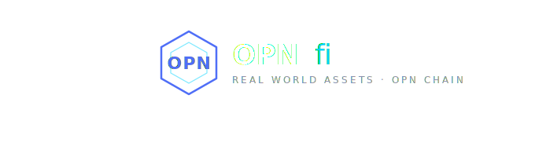

<div align="center">
  <br />
  <a href="https://automatic-doodle-pjpqg467q6j7hwxw-5173.app.github.dev" target="_blank">
    
  </a>
  <br /><br />

  <div>
    
    
    
    
    
  </div>

  <h1 align="center">OPNfi — Real World Assets on OPN Chain</h1>

  <p align="center">
    Tokenize and trade fractional ownership of real-world properties,<br/>
    fully on-chain via smart contracts on the OPN Testnet.
  </p>

  <a href="https://automatic-doodle-pjpqg467q6j7hwxw-5173.app.github.dev" target="_blank">
    
  </a>
  <a href="https://testnet.iopn.tech/address/0x29c57355C070f27E54cF499114EeC8F3865f0321" target="_blank">
    
  </a>
</div>

---

## 📋 Table of Contents

1. 🤖 [Introduction](#introduction)
2. ⚙️ [Tech Stack](#tech-stack)
3. 🔋 [Features](#features)
4. 🤸 [Quick Start](#quick-start)
5. 🔗 [Smart Contract](#smart-contract)
6. 🌐 [IOPn Ecosystem](#iopn-ecosystem)
7. 🏘️ [Properties Listed](#properties-listed)

---

## <a name="introduction">🤖 Introduction</a>

**OPNfi** is a decentralized Real World Asset (RWA) platform built on [OPN Chain](https://chain.iopn.io) — the sovereign Layer 1 blockchain powering the Internet of People (IOPn) ecosystem.

It allows users to buy fractional shares of real estate properties — from Jakarta residences to Dubai skyscrapers and Tokyo towers — with full on-chain transparency. Each property is tokenized as an ERC-1155 multi-token on the OPN Testnet. Ownership is recorded directly on the blockchain and verifiable via the block explorer.

Built as part of the **IOPn Season 1 · DeFi & Open Finance** hackathon.

> If you're getting started or run into issues, join the [IOPn Discord](https://discord.gg/iopn) or [Telegram](https://t.me/iopn_io) community.

---

## <a name="tech-stack">⚙️ Tech Stack</a>

| Technology | Purpose |
|---|---|
| **React + Vite** | Frontend framework & build tool |
| **ethers.js v6** | Blockchain interaction |
| **Solidity (ERC-1155)** | Smart contract standard |
| **OPN Chain** | Layer 1 blockchain (Chain ID: 984) |
| **Pexels API** | Dynamic property images |
| **Google Maps Embed** | Property location maps |
| **CSS Variables** | Dark theme design system |

---

## <a name="features">🔋 Features</a>

👉 **Fractional Property Ownership** — Buy shares of real estate starting from 0.001 OPN

👉 **Fully On-Chain** — All transactions recorded on OPN Testnet smart contract

👉 **Live Portfolio** — Track your shares and ownership percentage in real-time

👉 **Wallet Integration** — Connect MetaMask, Rabby, OKX, or any EVM wallet

👉 **Wallet Dropdown** — Copy address, view on explorer, disconnect in one click

👉 **Property Detail Page** — Full info with location map, top holders, recent transactions

👉 **Loading Skeleton** — Smooth shimmer animation while fetching blockchain data

👉 **Faucet Page** — Get testnet OPN tokens with step-by-step guide

👉 **About Page** — Full IOPn ecosystem overview with links to all official projects

👉 **Admin Panel** — Owner can list new properties directly on-chain

👉 **Animated Logo** — Hexagon logo inspired by IOPn with pulse animation

👉 **Typing Effect** — Animated tagline in footer

---

## <a name="quick-start">🤸 Quick Start</a>

**Prerequisites**

- [Git](https://git-scm.com/)
- [Node.js](https://nodejs.org/) v18+
- [MetaMask](https://metamask.io/) or any EVM wallet

**Clone & Install**

```bash
git clone https://github.com/frankxeth/OPNfi.git
cd OPNfi
npm install
npm run dev
```

Open [http://localhost:5173](http://localhost:5173)

**Connect to OPN Testnet**

| Field | Value |
|---|---|
| Network Name | OPN Testnet |
| RPC URL | `https://testnet-rpc.iopn.tech` |
| Chain ID | `984` |
| Symbol | `OPN` |
| Explorer | `https://testnet.iopn.tech` |

**Get Testnet OPN**

Visit: **[faucet.iopn.tech](https://faucet.iopn.tech/)**

---

## <a name="smart-contract">🔗 Smart Contract</a>

| | |
|---|---|
| **Address** | `0x29c57355C070f27E54cF499114EeC8F3865f0321` |
| **Standard** | ERC-1155 |
| **Network** | OPN Testnet · Chain ID 984 |
| **Explorer** | [View ↗](https://testnet.iopn.tech/address/0x29c57355C070f27E54cF499114EeC8F3865f0321) |

---

## <a name="iopn-ecosystem">🌐 IOPn Ecosystem</a>

| Project | Description | Link |
|---|---|---|
| ⛓️ OPN Chain | Layer 1 blockchain (Cosmos SDK + EVM) | [chain.iopn.io](https://chain.iopn.io) |
| 🔄 OPN Swap | Decentralized exchange on IOPn | [swap.iopn.tech](https://swap.iopn.tech) |
| 🎓 IOPn Learn | Learn & earn OPN rewards | [learn.iopn.tech](https://learn.iopn.tech) |
| 💧 Faucet | Get testnet OPN tokens | [faucet.iopn.tech](https://faucet.iopn.tech) |
| 🏗️ Builders | Hackathon & builder program | [builders.iopn.tech](https://builders.iopn.tech) |
| 🔍 Explorer | Block explorer | [testnet.iopn.tech](https://testnet.iopn.tech) |

---

## <a name="properties-listed">🏘️ Properties Listed</a>

| # | Property | Location | Price/Share |
|---|---|---|---|
| 0 | Menteng Residence | Jakarta Pusat | 0.1000 OPN |
| 5 | Gedung MPR/DPR RI | Senayan, Jakarta | 0.0500 OPN |
| 6 | Kos Eksklusif Malioboro | Yogyakarta | 0.0200 OPN |
| 7 | Villa Ubud Bali | Ubud, Bali | 0.0150 OPN |
| 8 | Burj Khalifa Residences | Dubai, UAE | 0.2000 OPN |
| 9 | Shibuya Sky Tower | Tokyo, Japan | 0.1500 OPN |

---

<div align="center">
  <br />
  <p>Built with ❤️ by <a href="https://x.com/l1luna_">@l1luna_</a> on <a href="https://iopn.io">IOPn</a></p>
  <p><em>One chain. One identity. Fully sovereign.</em></p>
  <br />
  
</div>
